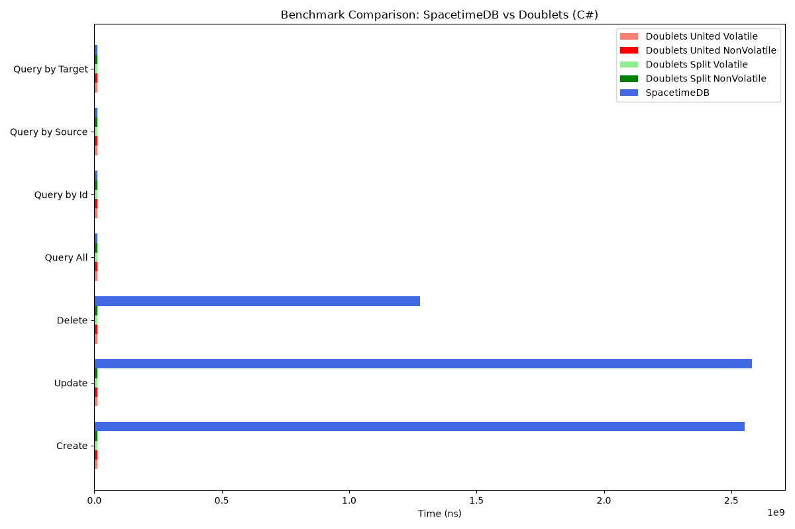
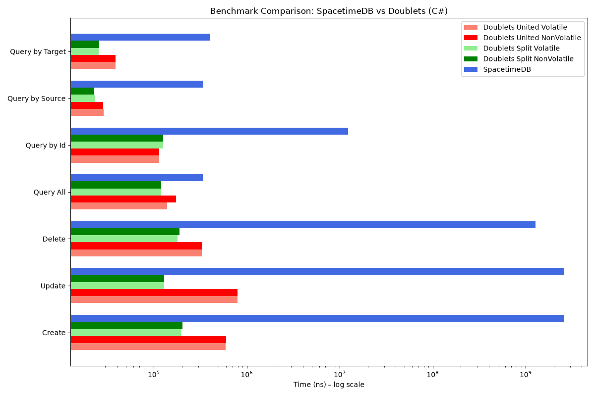

# Comparisons.SpacetimeDBVSDoublets

Benchmark comparing [SpacetimeDB 2](https://github.com/clockworklabs/SpacetimeDB) vs [Doublets](https://github.com/linksplatform/doublets-rs) performance for basic CRUD operations with links.

SpacetimeDB is benchmarked using the official Rust and C# SDKs connected to a running SpacetimeDB 2.10.1 server. Doublets is benchmarked with both in-memory (volatile) and file-backed (non-volatile) storage variants.

## Benchmark Operations

| Operation | Description |
|---|---|
| Create | Create a self-referential point link (id == source == target) |
| Delete | Delete links by id |
| Update | Update link source and target |
| Query All | Retrieve all links (`[*, *, *]`) |
| Query by Id | Retrieve a link by id |
| Query by Source | Retrieve all links with a given source |
| Query by Target | Retrieve all links with a given target |

## Backends Benchmarked

### SpacetimeDB
- **SpacetimeDB** — connects to a running SpacetimeDB 2.10.1 server via its official Rust or C# client SDK; uses the `links` table defined in the `spacetime-module` WebAssembly module

The benchmark uses the official SpacetimeDB client SDKs, calling reducers to mutate data and reading from the client-side subscription cache.

### Doublets
- **Doublets United Volatile** — in-memory store; links stored as contiguous `(index, source, target)` units
- **Doublets Split Volatile** — in-memory store; separate data and index memory regions
- **Doublets United NonVolatile** — file-backed store; same contiguous layout but memory-mapped to a single file; data persists to disk
- **Doublets Split NonVolatile** — file-backed store; separate data and index files; both memory-mapped; data persists to disk

Doublets uses a recursive-less size-balanced tree for O(1) lookup by id and O(log n + k) traversal by source/target. The file-backed variants use `memmap2` for memory-mapped file I/O, flushing changes to disk on drop via `sync_all()`. See [`rust/doublets-patched/PATCHES.md`](rust/doublets-patched/PATCHES.md) for why a local patched copy is used instead of the published crates.io version.

## Benchmark Background

Each benchmark iteration pre-populates the database with background links to simulate a realistic database state:

- **Background links**: `BACKGROUND_LINK_COUNT` (default: 3000) — already present before measurement
- **Benchmark links**: `BENCHMARK_LINK_COUNT` (default: 1000) — the operations being measured

## Results

The numbers below represent the time a single benchmark iteration takes, with
three significant digits and human-readable units. Doublets cells compare to
SpacetimeDB: `N× faster`, `N× slower`, or `≈ same` when medians differ by less than
5% of the SpacetimeDB median or their ±1 standard deviation ranges overlap.
These ranges describe measurement variability, not a significance test.

- The first chart shows time in a pixel (linear) scale. Doublets bars are drawn with a
  minimum visible width, otherwise they would not be visible next to SpacetimeDB.
- The second chart shows time in a logarithmic scale, to see the difference clearly,
  because it is around 3-5 orders of magnitude.

Charts and the table are recalculated by the
[Benchmark workflow](.github/workflows/rust-benchmark.yml) on every push to `main`
and committed back to this repository, so the results are visible here without running
the benchmark locally.

### Rust


### Rust results

<!--BENCHMARK_RESULTS_START-->
_Generated 2026-10-07 00:04 UTC by [GitHub Actions run 37549640595](https://github.com/linksplatform/Comparisons.SpacetimeDBVSDoublets/actions/runs/37549640595) — 1000 benchmarked links, 3000 background links. Rust SDK 2.10.1; Doublets (patched) 0.1.0-pre+beta.15; SpacetimeDB module 2.10.1; SpacetimeDB server/CLI 2.10.1; CPU — spacetimedb: AMD EPYC 7763 64-Core Processor; doublets: AMD EPYC 7763 64-Core Processor._

| Operation       | Doublets United Volatile | Doublets United NonVolatile | Doublets Split Volatile | Doublets Split NonVolatile | SpacetimeDB   |
|-----------------|--------------------------|-----------------------------|-------------------------|----------------------------|---------------|
| Create          | 76.9 µs (33,383× faster) | 76.5 µs (33,540× faster)    | 49.9 µs (51,405× faster) | 51.2 µs (50,116× faster)   | 2.57 s        |
| Update          | 244 µs (10,581× faster)  | 242 µs (10,697× faster)     | 40.4 µs (63,999× faster) | 41.5 µs (62,213× faster)   | 2.58 s        |
| Delete          | 179 µs (7,243× faster)   | 177 µs (7,286× faster)      | 99.9 µs (12,942× faster) | 134 µs (9,679× faster)     | 1.29 s        |
| Query All       | 21.6 µs (≈ same)         | 21.5 µs (≈ same)            | 28.3 µs (≈ same)        | 28.5 µs (≈ same)           | 28.9 µs       |
| Query by Id     | 2.44 µs (4,602× faster)  | 2.45 µs (4,582× faster)     | 2.67 µs (4,194× faster) | 3.07 µs (3,651× faster)    | 11.2 ms       |
| Query by Source | 11.8 µs (17.3× faster)   | 11.6 µs (17.6× faster)      | 11.7 µs (17.6× faster)  | 11.8 µs (17.4× faster)     | 205 µs        |
| Query by Target | 11.6 µs (16.3× faster)   | 11.8 µs (16.1× faster)      | 11.5 µs (16.5× faster)  | 11.5 µs (16.5× faster)     | 190 µs        |
<!--BENCHMARK_RESULTS_END-->

### C#

The .NET 10 benchmark uses `SpacetimeDB.ClientSDK` 2.10.1 and
`Platform.Data.Doublets` 0.18.1. It runs all seven operations and the same four
Doublets layouts, dataset sizes, and setup/reset steps as Rust. Both languages
wait for reducer completion on writes and materialize subscription-cache query
results. Rust processes SDK messages on its background thread; C# pumps
`FrameTick` on the calling thread, following the
[official C# SDK guidance](https://spacetimedb.com/docs/clients/c-sharp/).

C# sampling follows Criterion's automatic linear/flat schedule (PR: 10 samples,
1 s warm-up, 2 s measurement; full: 20 samples, 3 s warm-up, 5 s measurement).
Calibration includes setup/reset wall time; reported samples include only the
operation. This avoids excessive query sampling when setup involves network calls.

<!--CSHARP_RESULTS_START-->
_Generated 2026-10-07 00:04 UTC by [GitHub Actions run 37549640595](https://github.com/linksplatform/Comparisons.SpacetimeDBVSDoublets/actions/runs/37549640595) — 1000 benchmarked links, 3000 background links. SpacetimeDB.ClientSDK 2.10.1; Platform.Data.Doublets 0.18.1; SpacetimeDB module 2.10.1; SpacetimeDB server/CLI 2.10.1; CPU — spacetimedb: AMD EPYC 7763 64-Core Processor; doublets: AMD EPYC 7763 64-Core Processor._

| Operation       | Doublets United Volatile | Doublets United NonVolatile | Doublets Split Volatile | Doublets Split NonVolatile | SpacetimeDB   |
|-----------------|--------------------------|-----------------------------|-------------------------|----------------------------|---------------|
| Create          | 593 µs (4,304× faster)   | 595 µs (4,294× faster)      | 195 µs (13,070× faster) | 203 µs (12,565× faster)    | 2.55 s        |
| Update          | 788 µs (3,275× faster)   | 791 µs (3,264× faster)      | 129 µs (20,002× faster) | 128 µs (20,108× faster)    | 2.58 s        |
| Delete          | 325 µs (3,927× faster)   | 329 µs (3,881× faster)      | 180 µs (7,088× faster)  | 189 µs (6,754× faster)     | 1.28 s        |
| Query All       | 139 µs (≈ same)          | 173 µs (≈ same)             | 119 µs (≈ same)         | 119 µs (≈ same)            | 337 µs        |
| Query by Id     | 114 µs (108× faster)     | 114 µs (108× faster)        | 126 µs (97.7× faster)   | 126 µs (98.3× faster)      | 12.3 ms       |
| Query by Source | 28.7 µs (≈ same)         | 28.6 µs (≈ same)            | 23.3 µs (≈ same)        | 22.7 µs (≈ same)           | 342 µs        |
| Query by Target | 38.5 µs (10.5× faster)   | 38.6 µs (10.5× faster)      | 25.5 µs (15.8× faster)  | 25.7 µs (15.7× faster)     | 404 µs        |



<!--CSHARP_RESULTS_END-->

Each language/backend runs on a separate VM. The line above each generated table
records run, time, sizes, versions and the CPU of both backend VMs. Raw data and
metadata are retained as workflow artifacts. PR reports use reduced sizes and are
uploaded for review; only full default-branch results are committed.

## Conclusion

Doublets is an embedded store: an operation is a few pointer dereferences and tree
rotations in memory (or in a memory-mapped file), while every SpacetimeDB operation is a
reducer call over a WebSocket connection to a separate process, and every query is served
from the client-side subscription cache. The measured difference is dominated by that
architectural difference rather than by the data structures themselves.

To get fresh numbers, please fork the repository and rerun the benchmark in GitHub Actions.

## Operation Complexity

| Operation | SpacetimeDB | Doublets United | Doublets Split |
|---|---|---|---|
| Create | O(log n) + network | O(log n) | O(log n) |
| Delete | O(log n) + network | O(log n) | O(log n) |
| Update | O(log n) + network | O(log n) | O(log n) |
| Query All | O(n) cache read | O(n) | O(n) |
| Query by Id | O(n) cache scan | O(1) | O(1) |
| Query by Source | O(n) cache scan | O(log n + k) | O(log n + k) |
| Query by Target | O(n) cache scan | O(log n + k) | O(log n + k) |

The algorithmic complexity is the same for volatile and non-volatile Doublets variants. The non-volatile variants have additional I/O overhead due to memory-mapped file writes (flushed to disk on drop).

## Related Benchmarks

- [Neo4j vs Doublets](https://github.com/linksplatform/Comparisons.Neo4jVSDoublets)
- [PostgreSQL vs Doublets](https://github.com/linksplatform/Comparisons.PostgreSQLVSDoublets)
- [SQLite vs Doublets](https://github.com/linksplatform/Comparisons.SQLiteVSDoublets)

## Running Benchmarks

### Prerequisites

- Rust nightly, pinned in `rust/rust-toolchain.toml` (`rustup` installs it automatically)
- .NET 10 SDK for C#
- Python 3.11+ with `matplotlib` and `numpy` for reports
- SpacetimeDB CLI: `scripts/install-spacetimedb.sh` (pinned to 2.10.1), then add
  `$HOME/.local/bin` to `PATH`

### Start SpacetimeDB server and publish module

```bash
(cd rust/spacetime-module && cargo build --locked --release --target wasm32-unknown-unknown)
scripts/start-spacetimedb.sh

# Regenerate the committed C# client bindings after module changes:
spacetime generate --lang csharp --yes \
  --bin-path rust/spacetime-module/target/wasm32-unknown-unknown/release/spacetime_module.wasm \
  --out-dir csharp/SpacetimeDBVSDoublets/ModuleBindings
```

### Run benchmarks

```bash
# Full Rust run: N=1000, B=3000; choose one backend at a time.
(cd rust && BENCHMARK_BACKEND=spacetimedb cargo bench --locked --bench bench -- \
  --output-format bencher --sample-size 20 --nresamples 10000 > ../results-rust-spacetimedb.txt)
(cd rust && BENCHMARK_BACKEND=doublets cargo bench --locked --bench bench -- \
  --output-format bencher --sample-size 20 --nresamples 10000 > ../results-rust-doublets.txt)

# Full C# run, same defaults and sampling:
dotnet run --project csharp/SpacetimeDBVSDoublets -c Release -- --backend=spacetimedb > results-csharp-spacetimedb.txt
dotnet run --project csharp/SpacetimeDBVSDoublets -c Release -- --backend=doublets > results-csharp-doublets.txt

# Quick checks (N=10, B=30):
(cd rust && BENCHMARK_BACKEND=doublets BENCHMARK_LINK_COUNT=10 BACKGROUND_LINK_COUNT=30 \
  cargo bench --locked --bench bench -- --sample-size 10 --warm-up-time 1 --measurement-time 2)
dotnet run --project csharp/SpacetimeDBVSDoublets -c Release -- --backend=doublets --quick

# Record metadata on each backend's machine, with the same size variables:
python3 scripts/benchmark-metadata.py rust spacetimedb results-rust-spacetimedb.json
python3 scripts/benchmark-metadata.py rust doublets results-rust-doublets.json
python3 rust/out.py results-rust-spacetimedb.txt results-rust-doublets.txt \
  --metadata results-rust-spacetimedb.json results-rust-doublets.json \
  --results rust/results.md --readme README.md --output-dir docs/benchmarks
# Use --language csharp, C# input/metadata files and --results csharp/results.md for C#.
```

`BENCHMARK_LINK_COUNT` and `BACKGROUND_LINK_COUNT` configure either language.
`SPACETIMEDB_URI` and `SPACETIMEDB_DB` select the server and published database.
Doublets-only runs do not require a server. Run each backend separately to avoid
competing for CPU during measurement.

Query by source/target uses unique pairs referring to actual background IDs,
rather than duplicate pairs or hardcoded IDs that differ after SpacetimeDB resets.
Those operations require at least `10 + ceil(N/10)` background links (both default
and PR sizes satisfy this). Setup, dataset generation and reset are outside the
measured interval. Query results are consumed so the optimizer preserves the work.

### Tests and code quality

See [CONTRIBUTING.md](CONTRIBUTING.md) for all local checks. In particular:

```bash
(cd rust && cargo test --locked -- --test-threads=1 --include-ignored)
SPACETIMEDB_URI=http://localhost:3000 \
  dotnet run --project csharp/SpacetimeDBVSDoublets.Tests -c Release -- -parallelMode none
(cd rust && cargo fmt --all -- --check && cargo clippy --locked --all-targets -- -D warnings)
(cd rust && python3 -m unittest test_out -v)
```

The same-behavior tests compare all backends' create, update, delete, counts and
queries, including repeated source/target datasets. They normalize IDs by creation
order because SpacetimeDB preserves its sequence and Doublets reuses IDs. CI runs
the live server tests explicitly; they cannot silently skip an unavailable server.

## Project Structure

- `rust/`: Rust benchmark, adapters, tests, pinned toolchain and patched Doublets.
- `rust/spacetime-module/`: shared server-side WASM module.
- `csharp/SpacetimeDBVSDoublets/`: C# benchmark and generated SDK bindings.
- `csharp/SpacetimeDBVSDoublets.Tests/`: differential, iteration and sampling tests.
- `rust/out.py`, `rust/test_out.py`: shared report generator and regression tests.
- `scripts/`: pinned server installation/startup, metadata and repository checks.
- `docs/benchmarks/`: committed full-run charts for both languages.
- `.github/workflows/rust-benchmark.yml`: tests, isolated backend benchmarks and reporting.

## License

[Unlicense](LICENSE) — Public Domain
